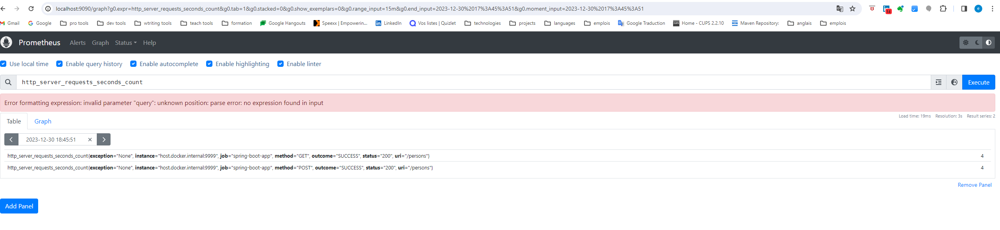

# How to use Prometheus


## Add metrics in spring boot application

* Add micrometer
```
implementation group: 'io.micrometer', name: 'micrometer-registry-prometheus', version: '1.12.1'
```

* enable actuator dependency
```
implementation group: 'org.springframework.boot', name: 'spring-boot-starter-actuator', version: '3.2.0'
```

* Add properties
```yml
management:
	endponts:
		web:
			exposure
				include: healths,prometheus
	server:
		port: 9999
```

* run API
```
./gradlew bootRun --args='--spring.profiles.active=dev'
```


## Use prometheus


* Run docker compose with
```
services:  
  prometheus:  
    image: prom/prometheus  
    container_name: prometheus  
    command:  
      - '--config.file=/etc/prometheus/prometheus.yml'  
    ports:  
      - 9090:9090  
    restart: unless-stopped  
    volumes:  
      - ./docker/prometheus:/etc/prometheus  
      - prom_data:/docker/prometheus
```

* Access to prometheus endpoint
```
http://127.0.0.1:9999/actuator/prometheus
```

* After call endpoint some times access to prometheus
```
http://localhost:9090/graph
```


